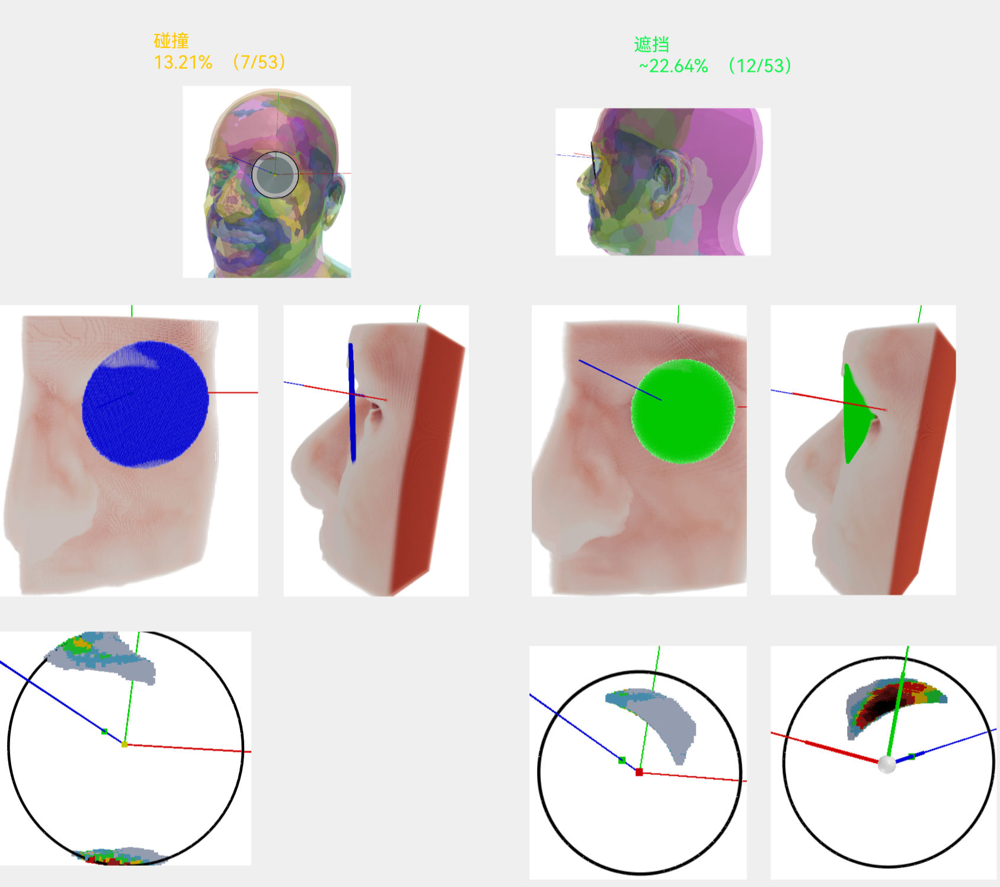

<!-- Improved compatibility of back to top link: See: https://github.com/othneildrew/Best-README-Template/pull/73 -->
<a name="readme-top"></a>
<!--
*** Thanks for checking out the Best-README-Template. If you have a suggestion
*** that would make this better, please fork the repo and create a pull request
*** or simply open an issue with the tag "enhancement".
*** Don't forget to give the project a star!
*** Thanks again! Now go create something AMAZING! :D
-->


<!-- PROJECT SHIELDS -->
<!--
*** I'm using markdown "reference style" links for readability.
*** Reference links are enclosed in brackets [ ] instead of parentheses ( ).
*** See the bottom of this document for the declaration of the reference variables
*** for contributors-url, forks-url, etc. This is an optional, concise syntax you may use.
*** https://www.markdownguide.org/basic-syntax/#reference-style-links
-->

<!-- PROJECT LOGO -->
<br />
<div align="center">
  <a href="https://github.com/SV-wang-xiaochen/Mesh">
    
  </a>
  <h1 align="center">头部模型碰撞遮挡模拟</h1>
</div>


<!-- TABLE OF CONTENTS -->
<!--<details>
  <summary>目录</summary>
  <ol>
    <li>
      <a href="#about-the-project">About The Project</a>
      <ul>
        <li><a href="#built-with">Built With</a></li>
      </ul>
    </li>
    <li>
      <a href="#getting-started">Getting Started</a>
      <ul>
        <li><a href="#prerequisites">Prerequisites</a></li>
        <li><a href="#installation">Installation</a></li>
      </ul>
    </li>
    <li><a href="#usage">Usage</a></li>
    <li><a href="#roadmap">Roadmap</a></li>
    <li><a href="#contributing">Contributing</a></li>
    <li><a href="#license">License</a></li>
    <li><a href="#contact">Contact</a></li>
    <li><a href="#acknowledgments">Acknowledgments</a></li>
  </ol>
</details>
-->


<!-- ABOUT THE PROJECT -->
## 关于本项目
<div align="center">
  <a href="https://github.com/SV-wang-xiaochen/Mesh">
    
  </a>
</div>


模拟镜片、面板等任何Mesh模型与53个头部模型的物理碰撞、光路遮挡，输出碰撞/遮挡3D热力图、统计图表等，辅助设计光学系统。
    
传统的碰撞、遮挡实验，只能通过机械方式来进行，十分不便。本项目利用Python程序精确模拟物理碰撞、光路遮挡，增加了便利性，提高研发效率。

<p align="right">(<a href="#readme-top">back to top</a>)</p>


## 开发环境
Python 3.10

[trimesh](https://trimesh.org/)

   ```sh
   pip install -r requirements.txt 
   ```
安装软件: MeshLab(用于Mesh预览), Blender(trimesh的某些功能依赖Blender)
<p align="right">(<a href="#readme-top">back to top</a>)</p>

## 头部模型数据库
[FLORENCE](https://www.micc.unifi.it/masi/research/ffd/)：53个欧洲人的头部模型

### 模型对齐

voxel_results文件夹下已经放置了处理过的FLORENCE数据库，可以直接用于碰撞/遮挡模拟。如果使用原始的FLORENCE数据库，请做以下处理。
<div align="center">
  <a href="https://github.com/SV-wang-xiaochen/Mesh">
    
    
    
    
  </a>
</div>

3D坐标系X-Y-Z如图1所示。53个Mesh人头，每个人头由5023个点组成，各Mesh的相同编号的点一一对应。但53个人头的姿态不同（图2），需要先做对齐（图3）。对齐之后，所有人头以X轴整体向下旋转8度，因为人的自然视角不是平视的，而是向下8度的（图4）。

步骤(注：需要在python代码中调整dataset路径):
1) 重新生成.obj文件：因为格式问题，在Meshlab中看到的顶点编号和trimesh导入后的编号不一致，所以先借助o3d重新生成.obj文件，可避免不一致的问题。
   ```sh
   python regenerate_obj_by_o3d.py
   ```
2) 按对齐原则对齐模型：中截面相互平行，中截面由脑门中线上的三个点确定（编号1203，1335，1726）；左眼前点（编号4043）坐标一致，为(0,0,0)；左眼眼轴，即左眼前点（编号4043）和后点（编号4463）的连线共面，且该面垂直于中截面。
   ```sh
   python alignment.py
   ```
3) 以X轴整体向下旋转8度。
   ```sh
   python transform_head_mesh_aligned_v1.py
   ```
4) 处理好的obj模型需要放在voxel_results/FLORENCE/registrations文件夹下。
   
<p align="right">(<a href="#readme-top">back to top</a>)</p>

<!-- GETTING STARTED -->
## 碰撞/遮挡模型的设计
具体实现方法见：
https://github.com/SVisions/OCT-Product/issues/8784

主要内容包括：Mesh模型封口、Mesh模型转Voxel模型、俯仰角定义、内外旋角定义、正侧眼位定义、热力图颜色定义等。

遮挡模拟和碰撞模拟类似，只不过将镜片/面板模型改为光路圆锥。
<p align="right">(<a href="#readme-top">back to top</a>)</p>

## 碰撞/遮挡模型的使用
1) mesh转为voxel: 生成头部模型的voxel文件和必要的参数文件，其中可以调整voxel尺寸大小和voxel空间的有效范围。<br/> voxel尺寸越小，模型越精确，但计算越慢，目前使用的voxel最小尺寸是0.4mm。<br/>voxel空间有效范围需要包含可能发生碰撞/遮挡的区域（即头部模型左半部分的前表面），在此基础上，有效范围越小，计算越快：
   ```sh
   python mesh2voxel.py
   ```
   
2) 将生成的所有npy文件，全部放入voxel_results文件夹下。<br/>注：对于“镜片碰撞/遮挡”工作模式，需要放置预制的EllipticalCylinder.obj文件到voxel_results文件夹下，用于抠掉眼皮附近区域。
3) 启动程序:
   #### 方法1: Python开发环境
   ```sh
   python voxel_voxel_intersection_visualization.py
   ```
   
   程序启动后，弹出“输入工作模式”界面：
    <div align="center">
      <a href="https://github.com/SV-wang-xiaochen/Mesh">
        
      </a>
    </div>
       
   输入参数，点击确认后，弹出“输入工作参数”界面：
    <div align="center">
      <a href="https://github.com/SV-wang-xiaochen/Mesh">
        
      </a>
    </div>
       
   输入参数，点击确认后，等待程序输出3D图、表格、打印参数和结果(如下图)。注：对于弹出的3D图，需要关闭当前3D图后，才会弹出后续3D图。
    <div align="center">
      <a href="https://github.com/SV-wang-xiaochen/Mesh">
        
      </a>
    </div>   
    
   #### 方法2: 打包为exe
   ```sh
   pyinstaller.exe -F [CURRENT_PATH]/voxel_voxel_intersection_visualization.py
   ```
   dist文件夹下会生成voxel_voxel_intersection_visualization.exe，将其和voxel_results文件夹放在同一个目录下，即可双击启动程序。<br/>"voxel_voxel_intersection_visualization.exe+voxel_results文件夹"可脱离Python开发环境使用，可以在其他Windows电脑运行。

<p align="right">(<a href="#readme-top">back to top</a>)</p>

## 工作模式说明
实验结果模式选择：
1) 单组参数：对所有工作参数设置一组数值，生成一组碰撞/遮挡热力图（含若干幅3D图），打印一组碰撞/遮挡概率结果
2) 遍历参数：对机械俯仰角、机械内外旋角设置遍历范围，对其他工作参数设置一组数值，生成碰撞/遮挡概率excel表格，不生成任何3D图

机械模式选择：
1) 镜片碰撞/遮挡：机械模型为镜片，通过设置参数，实时生成镜片mesh
2) 面板碰撞：机械模型为预制的前面板mesh，文件格式为obj，存放在voxel_results文件夹下，在“输入工作参数”界面，输入文件名进行导入。比如，想使用p1.obj面板文件，则输入p1。<br/>面板格式要求：面板竖直放置，正对Z轴; 镜头前表面中心点为(0,0,0); 尽可能切掉与碰撞无关的部分，以加快计算速度。

<p align="right">(<a href="#readme-top">back to top</a>)</p>
